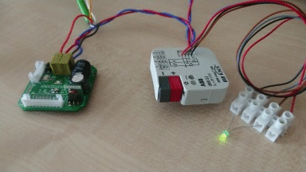

# KNXduino - KNX bus compatible DIY device based on STM32G071 MCU with Arduino flavour

## Testing Boards

* DEPRECATED (will be replaced by STM32G0 Nucleo board): [Nucleo-F303RE](https://www.st.com/en/evaluation-tools/nucleo-f303re.html)
    * Connections:
        * KNX RX voltage divider 33k:2k -> PB0 (COMP4_INP)
        * PB1 (COMP4_OUT) -> PA6 (TIM3_CH1)
        * PA7 (TIM3_CH2) -> TX MOSFET (shorting 68R to GND, 10k pull-down on gate)
        * KNX- <-> GND

* [KNXduino One](hw-design/knxduino-one/)
    * Note: make sure to connect NRST along with SWO, SWD and GND to ST-LINK while using OpenOCD

    

## Development Environment

Testing IDE: [Visual Studio Code](https://code.visualstudio.com/) + [Arduino plugin](https://marketplace.visualstudio.com/items?itemName=vsciot-vscode.vscode-arduino) + [Cortex-Debug plugin](https://marketplace.visualstudio.com/items?itemName=marus25.cortex-debug)

or [Arduino IDE 1.8.5](https://www.arduino.cc/en/main/software).

Testing Arduino Core: Additional URL https://github.com/stm32duino/BoardManagerFiles/raw/master/STM32/package_stm_index.json version 1.6.1

"Blink via KNX" sketch currently compiles to approx. 28072 bytes of Flash (without bootloader, size-optimized, without hard-coded addresses, no EEPROM emulation thus not configurable at all yet). Sketch consumes approx. 4mA while powered from KNX bus without any power optimizations. Bootloader is currently approx. 9kB. Thus perfectly OK for 128kB devices.

### Development Environment for Bootloader

Use Atollic TrueSTUDIO for STM32

## Steps to compile application (sketch)

* Use [KNXduino library](https://github.com/pavkriz/knxduino-library)
* Copy `hardware` folder to your sketches folder (eg. `~/Arduino`)
* Select `KNXdunino` board, and `KNXduino Nucleo F303RE with 32kB bootloader` in your IDE (eg. vscode or Arduino IDE)
* Select `U(S)ART support: Enable (no generic 'Serial')`
* Optional: Select `Optimize` menu according to your preferences

## Known issues in vscode

* Fix hardcoded `arduinoPath` path in `.vscode/c_cpp_properties.json` file
* ~~Fix hardcoded `cortex-debug.openocdPath` path in `.vscode/settings.json` file~~ build OpenOCD and install in PATH (see below)
* Fix hardcoded `cortex-debug.armToolchainPath` path in `.vscode/settings.json` file
* Fix hardcoded path to `st_nucleo_g0.cfg` in `.vscode/launch.json` file
* `Arduino: Upload` command does not work because of `output` option in `.vscode/arduino.json` file. Use `Arduino: Verify` followed by `Debug: Continue (F5)` instead.

Note on building OpenOCD for STM32G0: 
* `git clone --recurse-submodules https://repo.or.cz/openocd.git`
* patch http://openocd.zylin.com/gitweb?p=openocd.git;a=patch;h=dcec354bfc756c4a4e1034c9461b5d3f4e55a63e
* `./bootstrap`
* `./configure --disable-werror`
* `make`
* make sure you've uninstalled package-managed openocd from system (`sudo apt-get remove openocd`)
* `sudo make install`

## Steps to compile bootloader

Use Atollic TrueSTUDIO for STM32, open and build `bootloader` project.

## TODO

* ? Migrate to PlatformIO.org when it will fully support official ST's STM32duino Core (which we use here). PlatformIO.org has much better build and dependency management (configurable preprocessor defines, local references to particular Arduino Core, libraries,...). Watch https://github.com/platformio/platform-ststm32/issues/76

## Acknowledgement

* This project is based on [Selfbus project](http://www.selfbus.org).
* This work is supported by [hkfree.org](http://www.hkfree.org) community network.