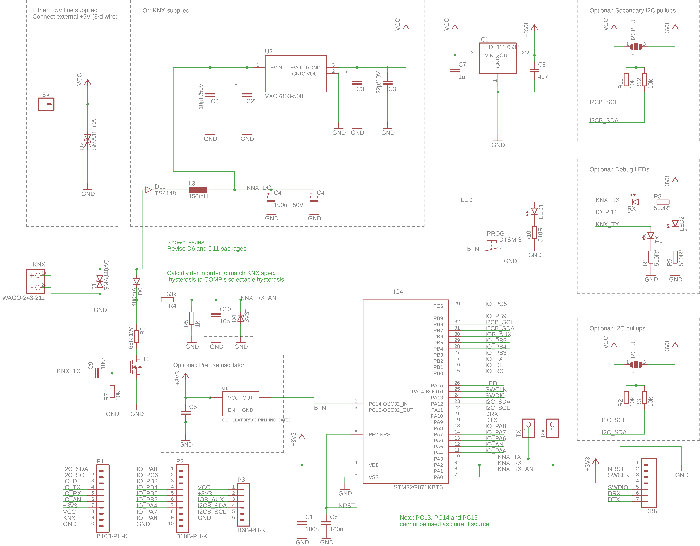

# KNXduino One board

Custom board with STM32G071 LQFP32 MCU that fits into a [Italtronic Cbox Int H19 KNX
](https://eng.italtronic.com/products/cbox_int_en/cbox_int_h19_knx_en/) box

# Schematic

# Board

